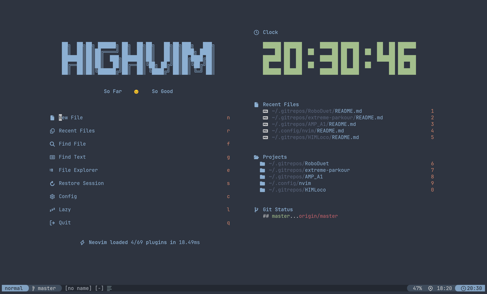

<p align="center">
    <h2 align="center"> HighVim
    </h2>
</p>

<p align="center" style="text-decoration: none; border: none; margin-bottom: 10px;">
    
    
</p>

<br>



## :cherry_blossom: Introduction

- This repo hosts my [Neovim](https://neovim.io/) configuration for Linux. 
- `init.lua` is the config entry point.
- Plugins are managed by [lazy.nvim](https://github.com/folke/lazy.nvim).
- Well configured colorthemes including: [catppuccin](https://github.com/catppuccin/nvim) and [nordfox](https://github.com/EdenEast/nightfox.nvim)
- HighVim also has a [vim configuration](https://github.com/SeaHI-Robot/highvim/tree/vim), but deprecated.

## :page_with_curl: Structure
```
lua
├── core
│   ├── autocmds.lua
│   ├── keymaps.lua
│   ├── lazy.lua
│   └── options.lua
└── plugins
    ├── config_1.lua
    ├── config_2.lua
    ├── config_3.lua
    └── ...

```
